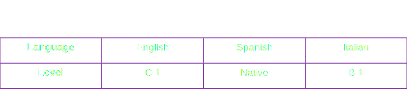

<div style="width: 100%; overflow: hidden;">
  <a href="https://youtu.be/dQw4w9WgXcQ">
    
  </a>
</div>
<br>

<p style="text-align: justify;">
Coding is like solving a puzzle, except half the pieces are missing, and you're blindfolded. But fear not, I have mastered the art of frustration and perfected the eye-roll when faced with cryptic error messages that seem to speak an alien language. Sometimes I can even ignore the traceback and pretend it doesn't exist.

It's because of these challenges and my ability to tackle them head-on that I am currently studying Information/Software Engineering.

I do speak human languages too, you can find more about that here:
<p align="center">
  <a href="https://youtu.be/dQw4w9WgXcQ">
    
  </a>
</p>

<div style="width: 100%; overflow: hidden;">
  <a href="https://youtu.be/dQw4w9WgXcQ">
    
  </a>
</div>

## My languages and technologies

[](https://www.java.com/)
[](https://spring.io/projects/spring-boot/)
[](https://www.postgresql.org/)
[](https://www.mongodb.com/)
[](https://www.mysql.com/)
[](https://www.oracle.com/database/sqldeveloper/)
[](https://cplusplus.com/)
[](https://learn.microsoft.com/en-us/dotnet/csharp/)
[](https://www.freepascal.org/download.html)
[](https://yassinebridi.github.io/asm-docs/asm_tutorial_01.html)
[](https://www.python.org/)
[](https://www.mathworks.com/products/matlab.html)
[](https://octave.org/)
[](http://tibasicdev.wikidot.com/starter-kit)
[](https://www.r-project.org/)
[](https://developer.mozilla.org/en-US/docs/Web/CSS)


## My Favorite IDEs and editors
[](https://code.visualstudio.com/)
[](https://visualstudio.microsoft.com/downloads/)
[](https://jupyter.org/)
[](https://www.jetbrains.com/pycharm/)
[](https://www.jetbrains.com/idea/)
[](https://www.jetbrains.com/datagrip/)
[](https://www.jetbrains.com/webstorm/?var=1)
[](https://netbeans.apache.org/front/main/)
[](https://www.eclipse.org/)
[](https://navicat.com/en/) 


## Tools & OS I use:
[](https://www.docker.com/)
[](https://www.riverbankcomputing.com/static/Docs/PyQt5/)
[](https://www.tensorflow.org/)
[](https://keras.io/)
[](https://scikit-learn.org/)
[](https://www.rabbitmq.com/)
[](https://python-poetry.org/)
[](https://www.cisco.com/c/en/us/td/docs/ios/fundamentals/command/reference/cf_book.html)
[](https://www.pgadmin.org/)
[](https://www.postman.com/)
[](https://hoppscotch.io/)
[](https://help.hitachivantara.com/Documentation/Pentaho/Data_Integration_and_Analytics/9.1/Products/Pentaho_Data_Integration)
[](https://www.alteryx.com/products/alteryx-designer)
[](https://git-scm.com/)
[](https://www.microsoft.com/en-us/power-platform/products/power-bi)
[](https://www.jaspersoft.com/)
[](https://www.figma.com/)

[](https://www.microsoft.com/en-us/software-download/windows10)
[](https://ubuntu.com/)
[](https://www.kali.org/)

## Im currently learning

[](https://dart.dev/)
[](https://flutter.dev/)
[](https://kubernetes.io/)
[](https://nextjs.org/)
[](https://react.dev/)
[](https://www.javascript.com/)
[](https://www.typescriptlang.org/)
[](https://nodejs.org/en)
[](https://docs.pycord.dev/en/stable/)
[](https://discordpy.readthedocs.io/en/stable/)


<br>
<div style="width: 100%; overflow: hidden;">
  <a href="https://youtu.be/dQw4w9WgXcQ">
    
  </a>
</div>


## My GitHub stats


<table>
  <tr>
    <td colspan="2" align="center">
      <a href="https://www.youtube.com/watch?v=dQw4w9WgXcQ">
        
      </a>
    </td>
  </tr>
<tr>
  <td colspan="2" align="center">
    <pre style="border: none; padding: 0;"><!--START_SECTION:waka-->

```txt
textmate            2 mins          ███████████████████████░░   91.70 %
SCSS                0 secs          ▒░░░░░░░░░░░░░░░░░░░░░░░░   01.88 %
TOML                0 secs          ▒░░░░░░░░░░░░░░░░░░░░░░░░   01.32 %
Docker              0 secs          ▒░░░░░░░░░░░░░░░░░░░░░░░░   01.21 %
TypeScript          0 secs          ▒░░░░░░░░░░░░░░░░░░░░░░░░   01.20 %
```

<!--END_SECTION:waka--></pre>
  </td>
</tr>
  <tr>
    <td align="center">
      <a href="https://www.youtube.com/watch?v=dQw4w9WgXcQ">
        
      </a>
    </td>
    <td align="center">
      <a href="https://www.youtube.com/watch?v=dQw4w9WgXcQ">
        
      </a>
    </td>
  </tr>
  <tr>
    <td colspan="2" align="center">
      <a href="https://www.youtube.com/watch?v=dQw4w9WgXcQ">
        
      </a>
    </td>
  </tr>
</table>
