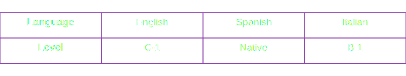

  

 

Coding is like solving a puzzle, except half the pieces are missing, and you're blindfolded. But fear not, I have mastered the art of frustration and perfected the eye-roll when faced with cryptic error messages that seem to speak an alien language. Sometimes I can even ignore the traceback and pretend it doesn't exist.

It's because of these challenges and my ability to tackle them head-on that I am currently studying Information/Software Engineering.

I do speak human languages too, you can find more about that here:

  

  

## My languages and technologies

## My Favorite IDEs and editors

## Tools & OS I use:

## Im currently learning

 

  

## My GitHub stats

<table>
  <tr>
    <td colspan="2" align="center">
      
    </td>
  </tr>
  <tr>
    <td colspan="2" align="center">
      <a href="https://www.youtube.com/watch?v=dQw4w9WgXcQ">
        <pre style="border: none; padding: 0;"><!--START_SECTION:waka-->
Markdown     1 hr 36 mins    █████████████████▓░░░░░░░   70.04 %
Env File     12 mins         ██▒░░░░░░░░░░░░░░░░░░░░░░   09.04 %
SVG          12 mins         ██▒░░░░░░░░░░░░░░░░░░░░░░   08.79 %
XML          11 mins         ██░░░░░░░░░░░░░░░░░░░░░░░   08.49 %
YAML         2 mins          ▒░░░░░░░░░░░░░░░░░░░░░░░░   01.73 %
<!--END_SECTION:waka--></pre>
      </a>
    </td>
  </tr>
  <tr>
    <td align="center">
      
    </td>
    <td align="center">
      
    </td>
  </tr>
  <tr>
    <td colspan="2" align="center">
      
    </td>
  </tr>
</table>
